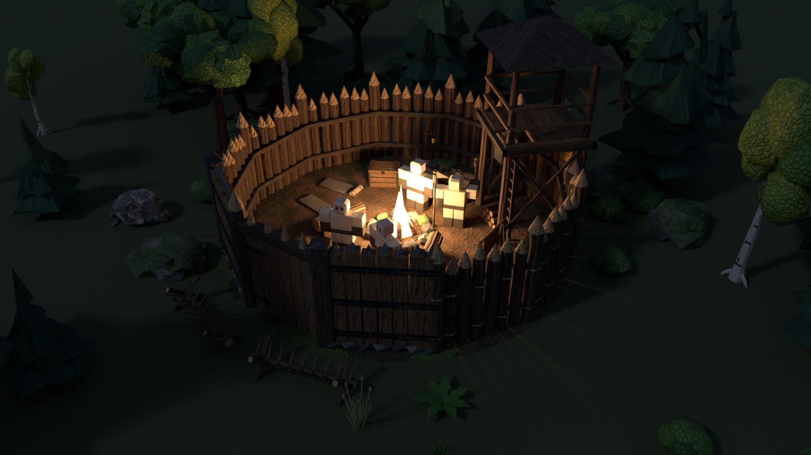

# Survival Hour: 3D asset pack

A 3D asset pack for **Survival Hour**, a Roblox game where four teams of four survive in a forest
and raid each other's camps. Every model is built by Blender Python scripts in `blender/` and exported
as Roblox-ready FBX, with editable `.blend` source, textures, rigs, animations, collision and data for
Studio.



## What's in the pack

| Group | Contents |
|---|---|
| Forest kit | 3 harvestable small trees (+ stumps), 8 medium/large trees (pine, oak, birch, dead), stumps, fallen and hollow logs, branches, loose sticks, 3 rocks, 3 boulders, harvestable stone deposit (+ depleted), fibre plant (+ harvested), 3 grass clumps, 3 bushes, 2 ferns, floor props, 3 landmarks, clearing patch, camp dressing |
| Stream kit | Straight, 90° bend and pool-end banks that snap on a 16-stud grid; separate water surfaces; streambed rocks |
| Starting camp | Campfire in burning / extinguished / cold-wet states, separate flame mesh, water-target ring, fire/smoke/light/extinguish attachments, workbench levels 1-3 |
| Craftables L1 | Stone axe, storage chest (+ hinged lid, damaged), wooden palisade wall (+ damaged, end post), spear, repair hammer, destruction debris |
| Craftables L2 | Canteen, bow, arrow + arrow bundle, gate (+ separate door, damaged door), spikes (+ damaged) |
| Craftables L3 | Sword, shield, reinforced wall (+ damaged), watchtower with ladder and hatch, 6-piece rigid R15 armour set |
| Pickups | Stick, stone, wood, fibre, rope, leather, ammo, bandage, diamond (+ transparent PNG icons) |
| Loot | Care package crate + hinged lid, parachute canopy + lines (separate), beacon, landing marker, 3 supply crates (+ lids), held bandage, 3 ammo types |
| Firearms | Pistol (+ slide), pump shotgun (+ pump), bolt rifle (+ bolt), with Grip / Muzzle / ShellEject / SecondHand attachments |
| Wildlife | Rigged wolf, bear, bat with Idle, Walk/Fly, Run/FastFly, Alert, Attack, Hit, Death, plus wolf Howl and bear RearUp; hitboxes |
| Lobby | Gathering deck, ready-up arch, party platform, powerup stand, shop stall, 4 signs with separate blank UI panels, 6 powerup emblems |

Full list with sizes, triangle counts and intended use: **[Docs/CATALOG.md](CATALOG.md)**.

## Folders

```
Source/SH_AssetPack.blend        editable source: every asset, one collection per category,
                                 plus the sample scenes (Scene_Camp, Scene_Clearing, Scene_Lobby)
Export/Meshes/<Category>/*.fbx   Roblox-importable meshes (SM_ = static mesh, ACC_ = accessory)
Export/LOD/<Category>/*_LOD1.fbx lower-detail versions of trees, foliage, rocks, walls, campfire
Export/Collision/**/COL_*.fbx    simple box collision proxies (also in the Luau data)
Export/Rigs/SK_*.fbx             skinned, rigged wildlife
Export/Animations/<Creature>/A_*.fbx   one animation clip per file
Textures/                        1024² PBR atlas: Color (Neutral/Red/Blue/Yellow/Purple), Normal,
                                 Roughness, Metalness, and a 256² colour preview that is embedded in each FBX
Roblox/SurvivalHourSetup.lua     Studio helpers: pivots, attachments, collision, tools, accessories, team colours
Roblox/SurvivalHourAssetData.lua generated data: sizes, pivots, attachments, collision, parts, animations
Roblox/catalog.json              machine-readable catalog
Renders/                         per-asset previews, held/worn views, pose frames, icons, contact sheets, scenes
Docs/                            catalog, import guide, pivots/attachments, rigs/animations, QA report
blender/                         the scripts that build all of the above
```

## Using it in Roblox

Start with **[Docs/IMPORT.md](IMPORT.md)**: importer settings, the atlas/SurfaceAppearance setup,
team colours, and how to turn meshes into Tools, Accessories and animated rigs.
Also see [Docs/PIVOTS_ATTACHMENTS.md](PIVOTS_ATTACHMENTS.md) and
[Docs/RIGS_ANIMATIONS.md](RIGS_ANIMATIONS.md).

Conventions used everywhere:

- **1 Blender unit = 1 stud.** The reference dummy (`SM_Reference_Dummy_R15`) is 5.25 studs tall.
- **Front is Roblox -Z** (LookVector), **up is +Y**.
- **One material per mesh**: every mesh uses the same texture atlas.
- **Pivots at useful anchors**: bottom centre for props and structures, the grip for held items,
  the hinge or slide axis for moving parts, the R15 attachment for armour.
- Walls, gates, reinforced walls and spikes share an **8-stud snapping grid**.

## Verification: what was and wasn't tested

- **Checked:** every exported FBX was re-imported into a clean Blender scene and compared with the
  catalog: triangle counts, dimensions, one material with an embedded texture, UVs, `_Att` attachment
  names, LOD and collision files, rig bone counts, at most 4 skin influences and none on Root, every
  animation clip present with the right length, and the axis mapping (muzzles and tips point to Roblox
  -Z). Every asset was also checked for open edges (holes), non-manifold edges and duplicate faces.
  Results: **[Docs/QA_REPORT.md](QA_REPORT.md)**.
- **Not tested:** nothing was imported into **Roblox Studio**, because it wasn't available in the
  environment used to build the pack. Scale, materials, collisions, rigging and animation playback in
  Studio, and the Luau helpers, are therefore unverified. Import a few representative files first
  (see IMPORT.md).

## Known limitations

- **Textures are procedural:** generated by code, not hand-painted. They are consistent and tile
  cleanly, but simpler than painted textures.
- **Armour is rigid** (Roblox rigid accessories), fitted to Classic-scale block proportions. It doesn't
  deform, and may need offset tweaks on Rthro or very wide/tall avatars. There is no layered-clothing
  (cage) version.
- **Bowstring** is modelled at rest; there is no drawn-string mesh or blend shape.
- **Custom LOD files** must be swapped by your own script. Roblox's built-in `RenderFidelity`
  (Automatic) works on every mesh regardless.
- **Wildlife** has no LOD versions (1-2k triangles each).
- **Damage:** damaged variants exist for walls, reinforced walls, the gate door, spikes and the storage
  box. The watchtower uses the shared debris meshes instead of a damaged version.

## Rebuilding

```bash
pip install bpy pillow            # Python 3.11 (built and tested with bpy 5.0.1 = Blender 5.0)
                                   # or: blender --background --python blender/build.py -- [options]
python blender/build.py            # everything (about 10 minutes with renders)
python blender/build.py --no-render --only Forest,SM_Sword
python blender/make_docs.py        # regenerate catalog/docs/Luau data from Roblox/catalog.json
python blender/verify_exports.py   # re-import and check every exported file
```

Assets are defined in `blender/assets/*.py` with an `@asset(...)` decorator. The modelling kit
(`blender/sh/kit.py`) provides beveled boxes, swept tubes, lathes, extrusions, heightfields and
jittered rocks, and handles atlas UVs, smoothing, validation, attachments and collision.
