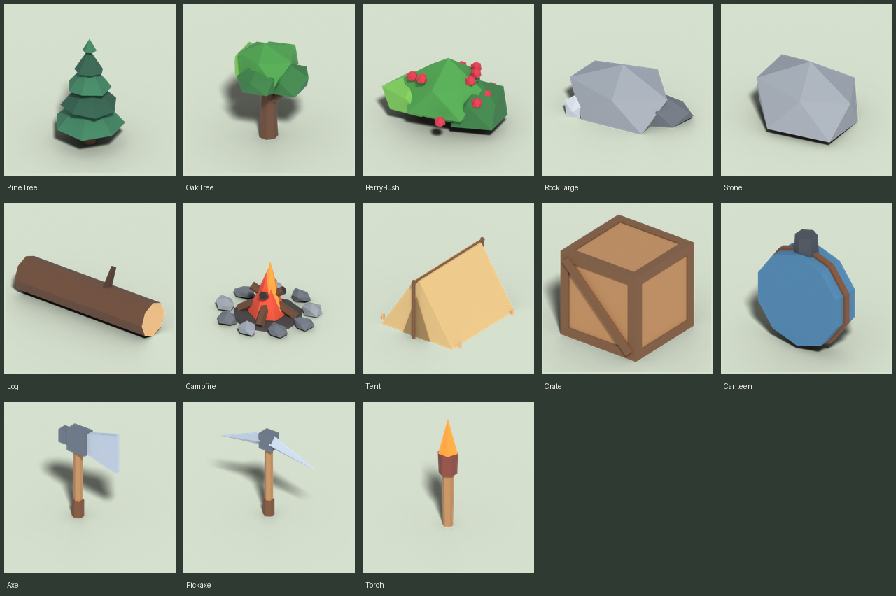

# Survival Hour

A Roblox survival game. This repo holds the game's low-poly 3D models, built in Blender.



## Starter assets

| Asset | Size in studs (W × D × H) | Triangles | Notes |
|---|---|---|---|
| PineTree | 10 × 10 × 16 | 82 | |
| OakTree | 10 × 9 × 12 | 164 | |
| BerryBush | 5 × 4 × 3 | 260 | Harvestable food |
| RockLarge | 10 × 6 × 3 | 60 | |
| Stone | 2 × 1.6 × 0.8 | 20 | Pickup resource |
| Log | 6 × 1.4 × 1.4 | 44 | Wood resource |
| Campfire | 5 × 5 × 3 | 324 | |
| Tent | 8 × 9 × 5 | 128 | |
| Crate | 3 × 3 × 3 | 180 | Storage |
| Canteen | 2 × 0.6 × 2 | 92 | Water item |
| Axe | 1.7 × 0.3 × 3.4 | 76 | Tool, origin at the grip |
| Pickaxe | 3 × 0.4 × 3.4 | 64 | Tool, origin at the grip |
| Torch | 0.5 × 0.5 × 3.4 | 56 | Tool, origin at the grip |

A Roblox character is about 5 studs tall. Every model is far below Roblox's limit of 20,000 triangles per mesh.

## Files

```
models/fbx/*.fbx                  one file per asset, ready for Roblox (texture embedded)
models/textures/survival_palette.png
models/survival_hour_assets.blend all assets, for editing in Blender
renders/                          preview images
blender/                          the scripts that build everything
```

All models share one small 64×64 **palette texture**: each face is mapped to a single colour cell. As a result, each asset imports as one MeshPart with one texture, which keeps the game fast. To recolour something, change its colour in `PALETTE` in `blender/lowpoly.py` and rebuild. Every asset using that colour updates.

## Importing into Roblox Studio

1. **Home → Import 3D** (or **File → Import 3D**), then pick a file from `models/fbx/`.
2. The models are made so that **1 Blender unit = 1 stud**. If a model comes in at the wrong size, set **Scale Unit** to **Stud** in the importer's file settings.
3. Suggested settings once it's in the world:
   - Trees, rocks, tents and crates: set `Anchored = true`. Set `CollisionFidelity` to `Box` or `Hull` so the physics stay cheap.
   - Tools (Axe, Pickaxe, Torch): rename the MeshPart to `Handle` and put it inside a `Tool`. The model's origin is already at the grip.
   - Campfire: add a `PointLight` and a `Fire` or `ParticleEmitter` to make the flames glow and flicker.

## Rebuilding or adding models

Everything is generated from `blender/assets.py`. To add a model, write a new function with the `@asset("Name")` decorator, using the building blocks in `blender/lowpoly.py`: `cylinder`, `cone`, `box`, `blob`, `prism`, `jitter` and `flatten_below`. Then rebuild:

```bash
# with Blender installed
blender --background --python blender/build_all.py

# or with the bpy Python module (Python 3.11): pip install bpy pillow
python blender/build_all.py
```

Add `--no-render` to skip the preview renders. You can also open `models/survival_hour_assets.blend` and edit the models by hand, but a rebuild will overwrite those edits.
